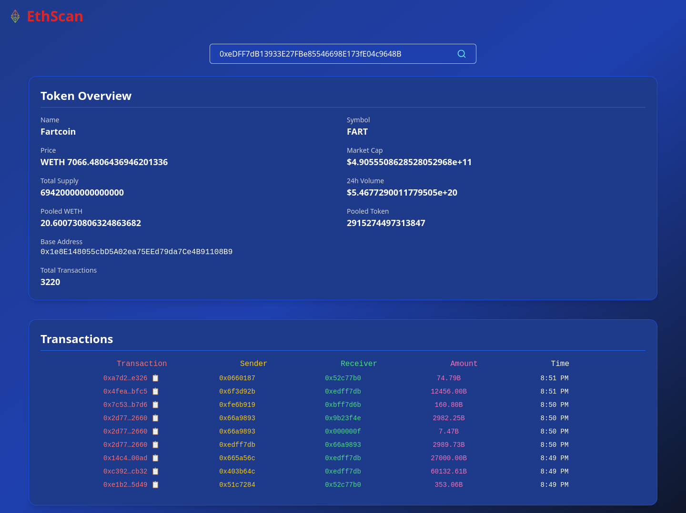

## Features
- Get Realtime transactions on erc token address
- Get Accurate token Metadata like price , pooled tokens and number of transactions

## Env
- HTTP_URL for https ethereum rpc node
- WS_URL for websocket connection to ethereum rpc node

## Run
docker compose up --build -d

## Image

