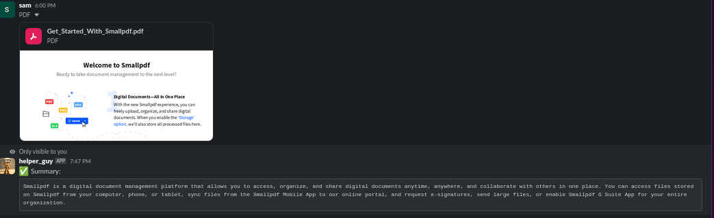
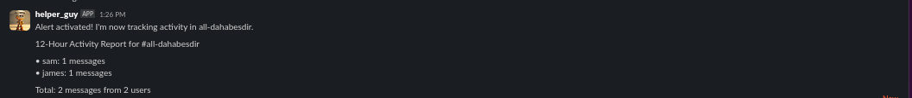

## Features
- Summarize documents using llm
- Send alerts for user activity monitors
- Manage user notes

## Slack Integeration
- Requires BOT and APP Token
- Socket mode enabled with event subscription for bot with channel.message permissions
- Required OAuth scopes: channels:read, chat:write, users:read, files:read

### Slack commands
- /accept-alerts Start receiving messages summary
- /cancel-alert Stop recieving messages summary
- /list-alerts List users accepted alerts
- /note Add a user note
- /get-notes get user notes
- /summarize summarize documents

## Run app
- Using docker-compose up --build -d
Or
- poetry install && poetry run -m python src.agent.main

- Depends On ENV SLACK_BOT_TOKEN, SLACK_APP_TOKEN, PORT
## how it looks=>

